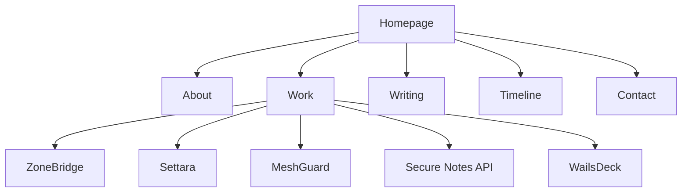
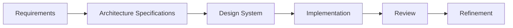

# Phil Aturo

> Building reliable software systems through thoughtful engineering.

[](#)
[](#)
[](LICENSE)

---

# Overview

Welcome.

This repository contains the source code, architecture documentation, and engineering specifications that power my personal portfolio website.

Rather than serving as a traditional résumé, this portfolio documents an ongoing engineering journey focused on building reliable software through thoughtful architecture, maintainable systems, and continuous learning.

Every page, component, and document is intentionally designed using the same engineering principles that guide the software projects presented throughout the portfolio.

---

# Engineering Philosophy

Good engineering is quiet.

It earns trust through reliability, consistency, and thoughtful execution—not unnecessary complexity.

Throughout this portfolio I prioritize:

- Reliability before novelty
- Readability before decoration
- Simplicity before abstraction
- Accessibility by default
- Documentation before implementation
- Long-term maintainability
- Continuous improvement

---

# Repository Contents

This repository contains:

- Portfolio website source code
- Engineering architecture specifications
- Design system documentation
- Technical writing foundation
- Engineering initiative pages
- Shared UI component library
- GitHub Pages deployment configuration

The portfolio itself is treated as an engineering project where architecture and documentation guide implementation.

---

# Technology Stack

The portfolio intentionally uses a lightweight, standards-based stack.

| Layer | Technology |
|--------|------------|
| Markup | HTML5 |
| Styling | CSS3 |
| Interaction | Vanilla JavaScript (ES Modules) |
| Deployment | GitHub Pages |
| Version Control | Git |
| Documentation | Markdown |

---

# Repository Structure

```text
.
├── index.html
├── about.html
├── work.html
├── writing.html
├── timeline.html
├── contact.html
│
├── initiatives/
│   ├── zonebridge.html
│   ├── settara.html
│   ├── meshguard.html
│   ├── secure-notes.html
│   └── wailsdeck.html
│
├── css/
│   ├── tokens.css
│   ├── typography.css
│   ├── layout.css
│   ├── components.css
│   ├── utilities.css
│   ├── animations.css
│   └── pages/
│
├── js/
│   ├── app.js
│   ├── navigation.js
│   └── footer.js
│
├── assets/
├── docs/
├── README.md
└── LICENSE
```

---

# Site Architecture



The navigation structure intentionally guides visitors from professional identity through engineering work, technical writing, project evolution, and opportunities for collaboration.

---

# Engineering Initiatives

The portfolio currently highlights several long-term engineering initiatives.

| Initiative | Primary Focus |
|------------|---------------|
| ZoneBridge | Distributed Systems & Edge Infrastructure |
| Settara | Financial Infrastructure & Offline Settlement |
| MeshGuard | DevSecOps & Infrastructure Resilience |
| Secure Notes API | Secure Backend Engineering |
| WailsDeck | Developer Tooling & Platform Engineering |

Each initiative emphasizes engineering problems, architectural thinking, implementation progress, and future direction rather than simply showcasing completed software.

---

# Documentation-First Development

This repository follows a documentation-first engineering workflow.



Implementation follows approved specifications rather than evolving organically.

This approach improves consistency, maintainability, and long-term scalability.

---

# Design Principles

The visual design follows an **Engineering Luxury** philosophy.

Characteristics include:

- Clean typography
- Spacious layouts
- Minimal visual noise
- Consistent spacing system
- Semantic HTML
- Accessible interactions
- Responsive layouts
- Shared reusable components

The objective is clarity—not decoration.

---

# Running Locally

Clone the repository.

```bash
git clone https://github.com/PhilAturo/philaturo.github.io.git

cd philaturo.github.io
```

Start a local development server.

Python:

```bash
python3 -m http.server 8000
```

Then visit:

```
http://localhost:8000
```

---

# Connect

Portfolio

> GitHub Pages deployment in progress.

GitHub

https://github.com/PhilAturo

LinkedIn

https://www.linkedin.com/in/aturo-phil-4b2a122a7

Hashnode

https://hashnode.com/@aturo-phil

X

https://x.com/aturo_09

Bluesky

https://bsky.app/profile/aturo-phil.bsky.social

Email

aturophil641@gmail.com

---

# License

The software contained within this repository is licensed under the MIT License.

Unless explicitly stated otherwise, all written content, engineering documentation, branding, and portfolio assets remain the intellectual property of Phil Aturo.

---

# Engineering Statement

Software changes.

Technologies evolve.

Engineering principles endure.

This portfolio represents an ongoing commitment to building reliable software systems through thoughtful architecture, disciplined engineering, and continuous learning.

---

**Phil Aturo**

Software Engineer

Backend Engineering • Distributed Systems • Infrastructure Engineering • Platform Engineering
